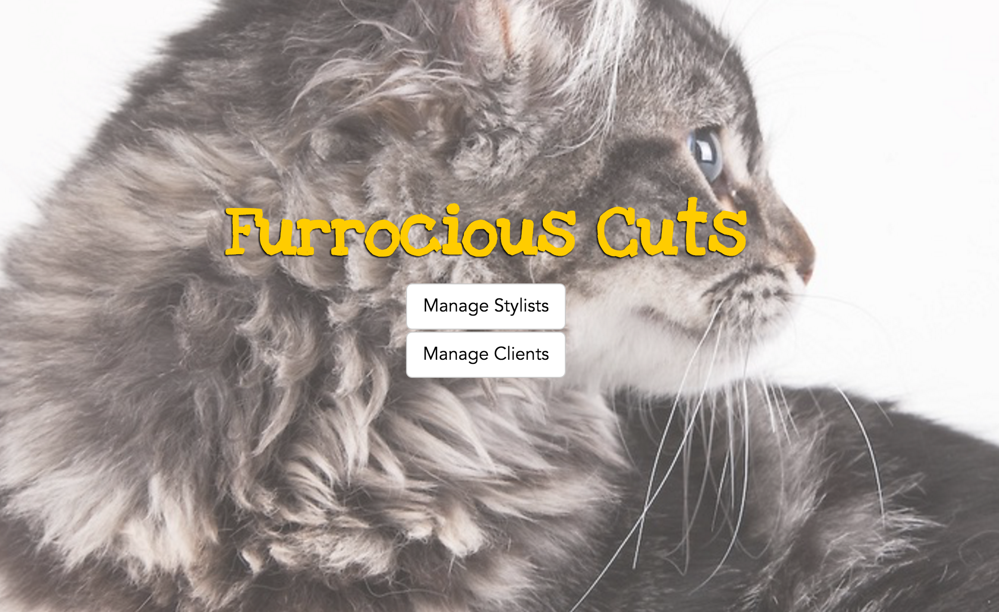

# hair-salon-php

#### An application for a hair salon that helps with the management of stylists and their clients. 10.06.2016

#### By [Lisa MacCarrigan] (https://github.com/lisamaccarrigan)

## Description

This is a web application for a hair salon that allows an owner to add stylists, and for each stylist, add clients who see that stylist.

## Specifications:
| _Behavior_ | _Input_ | _Output_ |
|:---------------------------------------------------------------------:|:---------------------------------------------------------------------------:|:-------------------------------------------------------------------------------------------------------------------:|
| Save New Stylist | "Lisa" | "Lisa" |
| Get/View All Stylists | n/a | list of stylists |
| Delete All Stylists | | |
| Find Stylist | | |
| Update Stylist | | |
| View All Clients For Given Stylist | | |
| Save New Client | "Lisa" | "Lisa" |
| Get/View All Clients | n/a | list of stylists |
| Delete All Clients | | |
| Find Client | | |
| Update Client | | |

## Setup/Installation Requirements

If editing:
* Clone this repository: https://github.com/LisaMacCarrigan/hair-salon-php.git
* OPEN project folder ('hair-salon-php') in Code Editor of choice
* Install and Configure PHP development environment - Please visit http://goo.gl/JDBJ0p for easy-to-follow instructions by Epicodus. In general, you will need to:
    * Download and Install 'MAMP' by visiting: https://www.mamp.info/en/downloads/.
    * Download and Install PHP package manager called 'Composer'
    * Inside of Terminal window, from the top level of your project folder, RUN the install command: > composer install
    * Inside of Terminal window, within the project's "web" folder, RUN the command: > php -S localhost:8000. Then, in a web browser, visit: http://localhost:8000/

## Known Bugs

No known bugs.

## Support and contact details

For comments or questions, please email Lisa.MacCarrigan@gmail.com

## Technologies Used

* HTML
* PHP
* MAMP Version 3.5.2
* MySQL Server
* phpMyAdmin Version 4.4.10
* Silex (PHP micro-framework)
* Twig (PHP template engine)
* Bootstrap CDN

### License

*This application is licensed under the MIT license*

Copyright (c) 2016 **Lisa MacCarrigan**
